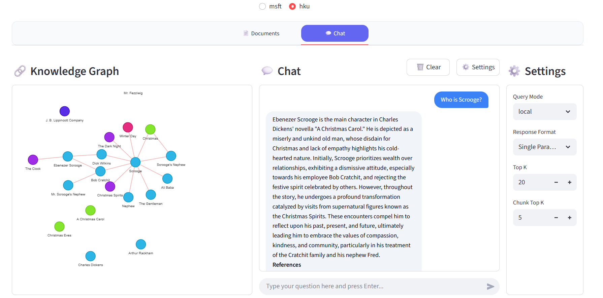

<div align="center">
    <a href="README.md">English</a> | 简体中文
</div>

## 🚀 项目演示

https://github.com/user-attachments/assets/7976d12e-1afb-4d72-9409-59ed46880cef




## 📋 环境要求

- **操作系统**: Ubuntu 24.04
- **Python 版本**: 3.10
- **包管理器**: Conda

## 🛠️ 安装与设置

请遵循以下步骤来设置项目运行环境。

1.  **克隆仓库**

    ```bash
    git clone https://github.com/zhiminwei551/GraphRAG-Demo.git && cd GraphRAG-Demo
    ```

2.  **创建并激活 Conda 环境**

    ```bash
    conda create --name graphrag-demo python=3.10 && conda activate graphrag-demo
    ```

3.  **安装依赖项**

    ```bash
    pip install -r requirements.txt
    ```

4.  **创建目录**

    项目运行需要特定的输入和输出目录，使用以下命令创建它们：

    ```bash
    mkdir -p hku/input hku/output msft/input msft/output
    ```

5.  **配置 OpenAI API 密钥**

    将您的 OpenAI API 密钥添加到 Shell 配置文件中。以下命令会自动将其追加到 `.bashrc` 文件。

    ```bash
    echo 'export OPENAI_API_KEY="sk-xxx"' >> ~/.bashrc && source ~/.bashrc
    ```

## ▶️ 运行项目

完成所有设置后，您可以使用 Streamlit 来运行此应用。

```bash
streamlit run app.py
```

运行命令后，打开您的浏览器并访问以下地址：

**`http://localhost:8501`**

