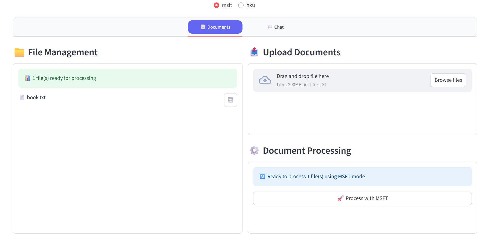

<div align="center">
    English | <a href="README-zh.md">简体中文</a>
</div>

## Project Demo




## Prerequisites

- **OS**: Ubuntu 24.04
- **Python**: 3.10
- **Package Manager**: Conda

## Setup & Installation

Follow these steps to set up the project environment.

1.  **Clone the Repository**

    ```bash
    git clone https://github.com/zhiminwei551/GraphRAG-Demo.git && cd GraphRAG-Demo
    ```

2.  **Create and Activate Conda Environment**

    ```bash
    conda create --name graphrag-demo python=3.10 -y && conda activate graphrag-demo
    ```

3.  **Install Dependencies**

    ```bash
    pip install -r requirements.txt
    ```

4.  **Create Directories**

    The application requires specific input/output directories. Create them using the following command:

    ```bash
    mkdir -p hku/input hku/output msft/input msft/output
    ```

5.  **Configure OpenAI API Key**

    Add your OpenAI API key to your shell configuration file. This command will append it to your `.bashrc`.

    ```bash
    echo 'export OPENAI_API_KEY="sk-xxx"' >> ~/.bashrc
    source ~/.bashrc
    ```
    
    > **Note**: Remember to restart your terminal or run `source ~/.bashrc` for the changes to take effect.

## Running the Project

Once the setup is complete, you can run the application using Streamlit.

```bash
streamlit run app.py
```

After running the command, open your web browser and navigate to the following address:

**`http://localhost:8501`**

